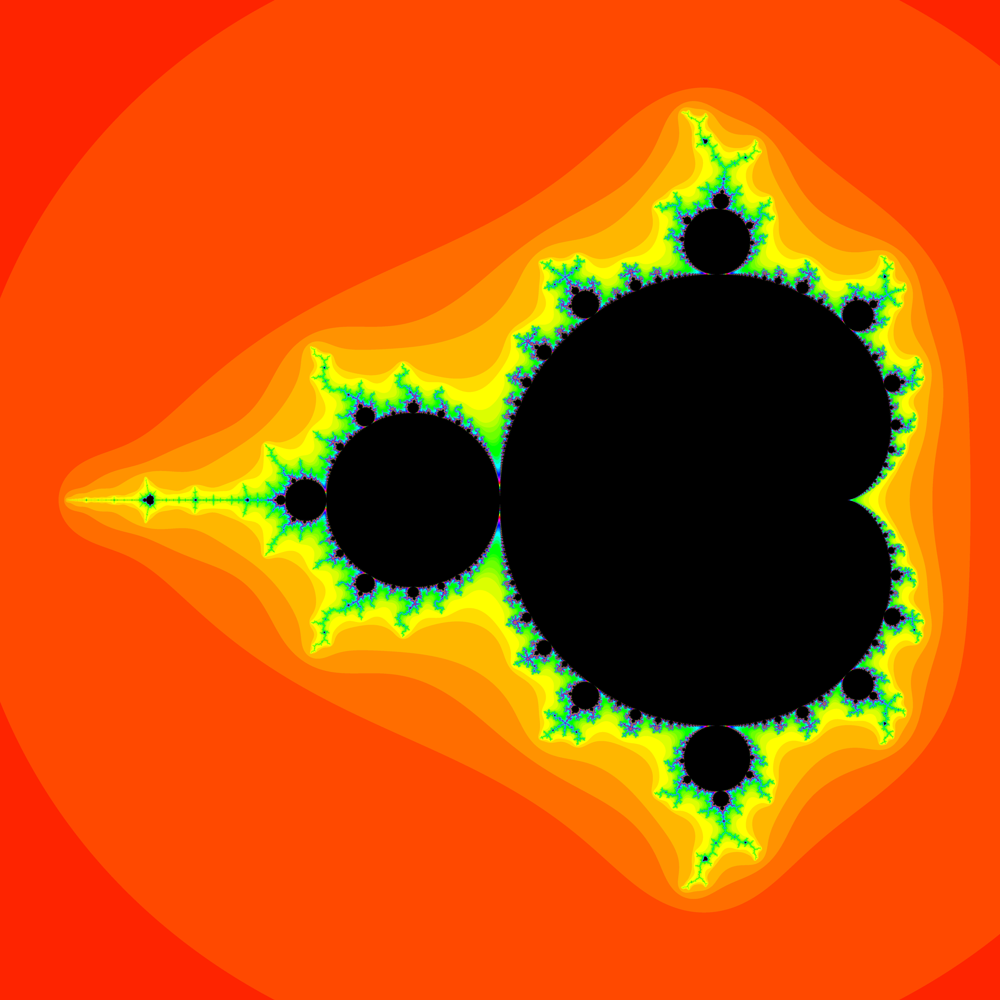

# rust_mandelbrot_set

> [!WARNING]
> This project is archived. No pull requests / issues will be accepted.
> Consider checking my profile to find a new Mandelbrot set generator.

## features

- supersampling
- multi-threading
- time escape
- pallette generation
- subsegmentation
- split processing
- process tracking

## requirements

- Rust
- imagemacick(1)
- UNIX-like OS
